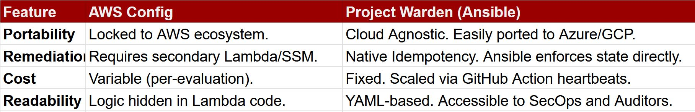

# 🛡️ Project Warden: Regional S3 Autonomous Governance

**An enterprise-grade, self-healing security framework designed to protect sensitive AI/ML datasets by enforcing regional S3 compliance through Continuous Audit, Drift Detection, and Automated Resolution.**

---

## 📖 The Project Story
In a fast-paced AI/ML environment, data is the most valuable asset. Manual security checks are insufficient for modern scale. This project documents a strategic journey from manual, reactive fixes to a **Proactive Regional Warden**.

### The Evolution:
1.  **Stage 1: The Reactive Fix (AWS CLI)** – Immediate manual remediation of specific public buckets.
2.  **Stage 2: The Scalable Script (Ansible Local)** – Moving toward Infrastructure-as-Code (IaC) for standardized policy enforcement.
3.  **Stage 3: The Automated Pipeline (GitHub Actions)** – Decoupling remediation from local environments and integrating it into a managed CI/CD lifecycle.
4.  **Stage 4: The Finale ,The Regional Warden** – An autonomous system that scans entire AWS regions on a 5-minute heartbeat to ensure zero-trust compliance for the whole fleet.

---

## 🏛️ Governance Philosophy: "Management by Exception"
I designed this system to mimic a high-performing corporate management structure.

> **The Analogy:** A professional manager stays silent as long as their team is meeting KPIs perfectly. It is only when performance degrades that the manager intervenes to provide correction.
>
> **The Warden** embodies this principle. It remains silent when your S3 buckets are secure (compliant). However, the moment a bucket "underperforms" (becomes public), the Warden corrects the mistake in seconds and provides a **Resolution Report** to the SOC team. It doesn't just flag problems; it enforces solutions.

---

## 🛠️ Technical Architecture & Workflow
The system is fully hosted and orchestrated within **GitHub Actions**, utilizing the following components:

* **Continuous Enforcement:** A GitHub Actions workflow triggered by a `schedule` (cron) every 5 minutes, ensuring a near-zero Mean Time to Remediation (MTTR).
* **Discovery Engine:** Uses `amazon.aws.s3_bucket_info` to dynamically discover every bucket in the targeted AWS region—eliminating the need for hardcoded bucket names.
* **Remediation Logic:** Leverages Ansible’s **Idempotency**; the system only executes changes if a bucket’s state has drifted from the "Private" gold standard.
* **Intelligent Alerting:** A Jinja2-powered HTML reporting engine that delivers a surgical audit trail via SMTP, but **only** when a healing action has actually occurred.

---

## 🚀 Technical Hurdles Overcome
* **IAM Scoping:** Debugged `403 Forbidden` errors by implementing a Least-Privilege IAM policy for the GitHub Runner.
* **CI/CD Resilience:** Resolved shell-level syntax errors and secret-handling conflicts within the YAML workflow to ensure 100% pipeline uptime.
* **Data Transformation:** Utilized Jinja2 filters (`selectattr` and `map`) to parse complex JSON API responses into human-readable email reports.

---

## 🔧 GitHub Actions Orchestration
The framework is designed to run entirely via GitHub's managed infrastructure, removing the need for local execution.

### **Required GitHub Secrets**
To deploy this, the following secrets must be configured in the repository:
* `AWS_ACCESS_KEY_ID` / `AWS_SECRET_ACCESS_KEY`: IAM credentials with S3 management permissions.
* `SMTP_USER` / `SMTP_PASS`: Credentials for the notification engine (e.g., Gmail App Password).
* `ADMIN_EMAIL`: The destination address for remediation reports.

### **Automated Trigger Configuration**
```yaml
on:
  schedule:
    # Triggered every 5 minutes for continuous governance
    - cron: '*/5 * * * *'  
  workflow_dispatch:       
    # Allows manual audit on-demand

### **Technical FAQ**
❓ Why not use AWS Config?
While AWS Config is a powerful native tool, Project Warden was architected for organizations that prioritize Cloud Agnostic Governance and Deterministic Enforcement.


